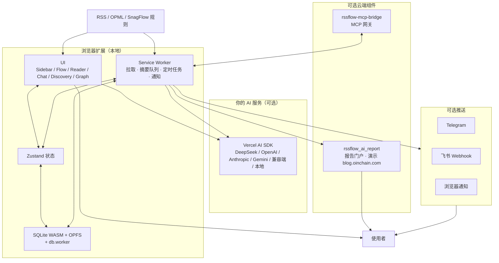

<p align="right">
  <strong>简体中文</strong> | <a href="./README_EN.md">English</a>
</p>

# RSSFlow

> 本地优先的 AI RSS 阅读器（Chrome / Edge 扩展）  
> 订阅、阅读、摘要、对话、图谱、定时简报与多端推送 —— 数据默认留在本机。

<p align="center">
  <a href="https://chromewebstore.google.com/detail/rssflow-ai-powered-rss-in/mefbfkpippglgoanjcbdjnkelcbdjija">
     Chrome 应用商店
  </a>
  &nbsp;·&nbsp;
  <a href="https://microsoftedge.microsoft.com/addons/detail/rssflow-aipowered-rss-/khgllclaeabkjgoblcipfpgaejblcelf">
     Edge 加载项
  </a>
  &nbsp;·&nbsp;
  <a href="https://rssflow.oinchain.com">
     产品官网
  </a>
</p>

<p align="center">
  
  
  
  
  
</p>

<p align="center">
  <a href="./CHANGELOG.md">更新日志</a> ·
  <a href="https://rssflow.oinchain.com/changelog">官网 Changelog</a> ·
  <a href="https://rssflow.oinchain.com/help">帮助中心</a> ·
  <a href="https://blog.oinchain.com">报告演示 blog.oinchain.com</a> ·
  <a href="https://rssflow.oinchain.com/privacy">隐私政策</a>
</p>

---

## 这个仓库是什么

**RSSFlow-doc** 是产品官网、帮助文档与公开版本说明仓库，**不是**扩展安装包仓库。

| 路径 | 作用 |
| --- | --- |
| `website/` | 官网源码（Next.js 静态导出） |
| `help/` | 帮助中心文稿 |
| `docs/` | 线上静态站产物（Cloudflare Pages 等） |
| [CHANGELOG.md](./CHANGELOG.md) | 完整版本历史（与官网同步） |

扩展请从上面的商店链接安装。当前公开版本：**v1.1.5**（2026-08-10）。

---

## 产品定位

RSSFlow 以浏览器 **侧边栏** 为主界面（不是小弹窗）：管理订阅、扫未读、打开沉浸阅读，以及跳转到 Flow / 图谱 / 发现 / 聊天等全屏能力。

它把常见 RSS 流程拆成几步：

1. **订阅与入库**（本地）  
2. **可选 AI 预读**（摘要、标签、评分，后台静默）  
3. **阅读与对话**（引文可追溯）  
4. **发现与图谱**（热点、关系检索）  
5. **定时任务与推送**（简报、Telegram / 飞书、报告发布）  
6. **可选 MCP**（把本地阅读上下文接到外部 AI 工具）

AI 使用 **你自己的 API Key**；未配置时仍可当普通 RSS 阅读器用。  
详细分章说明见帮助中心：https://rssflow.oinchain.com/help

---

## 核心功能

### 1. 订阅与源管理

- **添加方式**
  - 手动粘贴 RSS URL
  - 导入 OPML / XML
  - 从配套扩展 [SnagFlow](https://snagflow.oinchain.com) 一键导入规则（扩展间本地通信，不经过外网中转）
  - 推荐源：按语言与主题分类（中文、English，以及日语 / 韩语等）
- **源级控制**
  - 每源可开关 **Auto AI**（是否自动摘要）
  - 失败次数、错误状态可查看
  - 删除源会清理对应历史文章
- **为什么建议开自动摘要**  
  摘要会把文章拆成要点、标签与评分，供 Flow 筛选、图谱、定时任务和引文对话复用；直接对全文做重任务更容易超长、丢细节。

帮助： [添加订阅源](https://rssflow.oinchain.com/help/adding-feeds) · [订阅管理](https://rssflow.oinchain.com/help/feed-management) · [SnagFlow](https://rssflow.oinchain.com/help/snagflow-overview)

### 2. 侧边栏、Flow 与沉浸阅读

**侧边栏标签**

| 标签 | 说明 |
| --- | --- |
| 未读 | 默认列表，无限滚动，工具栏角标 |
| 收藏 | 已收藏文章 |
| 图谱 | **新标签**打开知识图谱，方便多关键词组合搜 |
| Flow | **新标签**打开信息流（按日 / 按标签） |

**交互习惯**

- 单击卡片 → 打开 Zen Reader  
- 双击 → 标记已读（可配木鱼音效），卡片收起  
- 标准 / 极简密度：极简更适合扫标题  
- 卡片优先展示 AI 摘要；悬停可看要点

**Flow 视图**

- **Dayflow**：先日期再标签，含「最近 24 小时」  
- **Tagflow**：先主题标签再文章  
- 右侧圆点锚点跳分组；每组可开「分组 AI 聊天」  
- 底部跑马灯可滚动 / 语音播报摘要（多标签页时只保留一个发声端）  
- 多列随窗口宽度自适应；滚动时会控制预取与合入，减少视口跳动（v1.1.5）

**Zen Reader**

- 全屏正文 + AI 侧栏（摘要、要点、标签、评分）  
- 暗色星空 / 浅色主题；窄屏 AI 区改为底部抽屉  
- 快捷键示例：`J`/`K` 上下篇，`Space` 翻页，`F` 收藏，`R` 已读并下一篇，`Enter`/`S` 摘要，`Esc` 关闭  
- 切换文章时预取相邻篇，降低连读等待

帮助： [界面导览](https://rssflow.oinchain.com/help/interface-guide) · [Flow](https://rssflow.oinchain.com/help/flow-view) · [Zen Reader](https://rssflow.oinchain.com/help/zen-reader) · [快捷键](https://rssflow.oinchain.com/help/reader-shortcuts)

### 3. AI 自动摘要

- 新文章入库后可进入后台队列，串行处理并保留间隔，降低限流风险  
- 产出摘要、观点 / 要点、标签、评分等字段，写入本地，卡片自动更新  
- **双模型配置**（设置 → AI 设置）  
  - **默认模型（Basic）**：摘要、评分、标签等轻量任务  
  - **复杂模型（Advanced，可选）**：聊天、定时任务、热点发现等；可从默认配置一键复制  
- 支持供应商包括 DeepSeek、OpenAI、OpenAI Compatible、Anthropic、Gemini、本地兼容端点等  
- 必须先打开「启用 AI 功能」，再验证并设为当前启用

帮助： [AI 密钥](https://rssflow.oinchain.com/help/ai-key-config) · [自动摘要](https://rssflow.oinchain.com/help/ai-auto-summary) · [提供商](https://rssflow.oinchain.com/help/provider-config)

### 4. AI 对话与专家指令

- **入口**
  - 侧边栏 **AI 聊天**（新标签）
  - Flow 分组右下角聊天（以该日期 / 标签组为上下文）
  - 知识图谱页、发现 / 热点面板也可把结果带进对话继续追问
- 可对筛选后的文章集合提问（日期、标签、订阅源等）
- 回答带 **引文胶囊**：悬停预览标题与摘要，点击回到对应原文位置
- **专家指令**：系统预置 **23** 条分析角色（研报、宏观、风险、写作、加密、全域速递等）；与「快捷指令」是同一套能力，也可自定义
- V3 聊天：SmartInput、命令面板、会话管理；清空会话会中止生成中请求并重置筛选残留（v1.1.5）
- 检索语义与发现 / 自动化对齐到 **共享检索内核**，关键词归一化与未读统计更一致

帮助： [引文对话](https://rssflow.oinchain.com/help/ai-chat-citation) · [专家指令](https://rssflow.oinchain.com/help/expert-commands) · [快捷指令](https://rssflow.oinchain.com/help/ai-commands)

### 5. 热点发现与知识图谱

**AI 发现**

- 分析近期文章，聚类热点话题
- 左侧趋势 / 分布，右侧话题简报（现象 → 逻辑 → 连带影响等结构，视模型输出）
- 可定时刷新，并配合浏览器通知

**图谱**

- 标签共现、实体 / 关键词关系可视化
- 支持组合检索；结果可一键带入定时任务
- Graph 提示与阅读相关文案已做多语言完善

帮助： [AI 发现](https://rssflow.oinchain.com/help/ai-discovery) · [知识图谱](https://rssflow.oinchain.com/help/graph-view)

### 6. 定时任务与报告发布

- **入口**：**设置 → 工作流**
- 任务列表可启用 / 禁用、编辑、删除、手动立即运行；执行历史保留最近约 50 条
- 多任务默认 **排队串行**，降低同时打满 API 的风险
- 后台按计划跑：整理上下文（常用已生成的 AI 摘要）→ 执行指令 → 生成简报
- **执行模式**
  - **单指令**：多篇文章一次汇总成一份报告（日常要闻）
  - **串行链路（Sequential Chain）**：上一步输出进入下一步（先提炼再扩写 / 翻译等）
  - **并行汇总（Split-Merge）**：多维度并行分析后再合成
- **报告发布**（任务列表上方 **发布设置**，全局通道）
  1. **默认通道（官方托管）**：零配置网页，适合手机阅读与转发
  2. **自定义通道（自建托管）**：自有地址 + 安全密钥，可设保留期（例如约 180 天）
  3. **博客门户（`rssflow_ai_report`）**：推到独立站点，支持分类 / 系列 / 作者 / 标签归档  
     - **公开演示（看推送到报告端的实际效果）**：[blog.oinchain.com](https://blog.oinchain.com)  
     - 流程：工作流生成简报 → 扩展按站点 URL + Auth Token 安全推送 → 门户生成可分享的页面  
     - 适合跨设备阅读：不必打开扩展也能看完整报告
- 可与 Telegram / 飞书 / 桌面通知、标签与日期筛选、失败重试组合

帮助： [定时任务概述](https://rssflow.oinchain.com/help/workflow-overview) · [执行模式](https://rssflow.oinchain.com/help/execution-modes) · [发布模式](https://rssflow.oinchain.com/help/report-modes) · [云报告门户](https://rssflow.oinchain.com/help/cloud-report-portal)

### 7. 多端推送

- **入口**：**设置 → 消息推送设置**
- **Telegram Bot** / **飞书 Webhook**：总开关 + 分项（文章摘要、定时任务报告、热点发现等），两者可同时开
- **浏览器通知**：桌面即时提醒
- 推送内容基于本地已处理结果；不会把整库上传到第三方（除你配置的 Bot / Webhook / 报告站点外）

帮助： [Telegram](https://rssflow.oinchain.com/help/telegram-push) · [飞书](https://rssflow.oinchain.com/help/feishu-push)

### 8. MCP 桥接

- 通过 MCP，把本地订阅与摘要提供给 Cursor、Claude 等外部工具  
- 配套 `rssflow-mcp-bridge`（Cloudflare Workers 网关）；扩展侧有桥接状态与权限控制  
- 适合「阅读在浏览器，分析在 IDE / Agent」的分工

帮助： [MCP 桥接](https://rssflow.oinchain.com/help/mcp-bridge)

### 9. 设置、多语言与主题

- 选项页常见分区：常规、订阅源、AI、推送、同步、自动化、主题等  
- **常规**：更新间隔、列表查询天数、历史保留、界面语言、音效等  
- **多语言**：界面与 AI 输出语言可切换（英 / 中 / 日 / 韩及多种欧洲与其他语言，随版本增减）  
- **主题**：浅色 / 深色 / 跟随系统；阅读器与侧边栏风格统一  
- **标签范围**：可按语言环境使用默认标签集，并扩展覆盖（v1.1.5）

帮助： [常规设置](https://rssflow.oinchain.com/help/general-settings) · [支持语言](https://rssflow.oinchain.com/help/supported-languages) · [Tag 范围](https://rssflow.oinchain.com/help/tag-scope) · [主题](https://rssflow.oinchain.com/help/theme)

### 10. 本地存储与隐私

- 扩展侧以 **SQLite（WASM + OPFS）+ 后台 db.worker** 承担更重的检索、统计与图谱相关读写；设置与部分状态仍走扩展存储  
- 默认不上传阅读库；只有 AI API、推送、报告发布、MCP 等你开启的功能会出站  
- 详见 [隐私政策](https://rssflow.oinchain.com/privacy) 与 [数据隐私说明](https://rssflow.oinchain.com/help/privacy-statement)

---

## 系统结构（示意）

下图描述「扩展本机 + 可选云能力」的关系。命名偏工程向，便于对照代码与帮助文档。



**相关工程（独立部署，不在本仓发安装包）**

| 工程 | 作用 |
| --- | --- |
| RSSFlow 扩展本体 | 商店上的阅读器 |
| `rssflow_ai_report` | 云端报告门户；公开演示 [blog.oinchain.com](https://blog.oinchain.com) |
| `rssflow-mcp-bridge` | MCP 网关 |
| SnagFlow | 网页 → RSS 的配套扩展 |

---

## 技术栈（扩展侧，摘要）

| 层面 | 选型 |
| --- | --- |
| 扩展规范 | Manifest V3 · Service Worker · Side Panel |
| UI | React 18 · Tailwind · Framer Motion 等 |
| 构建 | Rspack（由早期 webpack 迁来） |
| 状态 | Zustand |
| 本地库 | SQLite WASM + OPFS · 后台 Worker |
| AI | Vercel AI SDK · 多供应商 · Prompt 预编译 |
| 渲染 | 流式 Markdown（Streamdown 等）· 长列表虚拟化 |

本仓库官网：Next.js 静态导出，部署于 Cloudflare Pages（`rssflow.oinchain.com`）等。

---

## 版本与更新节奏

- 完整记录：**30 个版本**，自 2024-12 `v0.1.0` 至 2026-08 `v1.1.5`  
- 文件：[CHANGELOG.md](./CHANGELOG.md)  
- 页面：https://rssflow.oinchain.com/changelog  

**v1.1.5 要点**

- 文章检索语义统一（共享检索内核）  
- 关键词归一化与未读 / 检索完整性  
- Flow 滚动稳定性与清空会话状态清理  
- 推荐源日语 / 韩语与分类重构  
- 按语言环境适配默认标签集  

---

## 安装与首次使用

1. 从 [Chrome](https://chromewebstore.google.com/detail/rssflow-ai-powered-rss-in/mefbfkpippglgoanjcbdjnkelcbdjija) 或 [Edge](https://microsoftedge.microsoft.com/addons/detail/rssflow-aipowered-rss-/khgllclaeabkjgoblcipfpgaejblcelf) 安装（帮助文档说明以商店安装为准）  
2. 建议固定工具栏图标，便于看未读角标  
3. 点击图标打开 **侧边栏**  
4. （可选）设置 → AI 设置：启用 AI、填 Key、验证并设为当前模型  
5. 设置 → 订阅源：添加 URL / 导入 OPML / SnagFlow / 推荐源  

分步图文：https://rssflow.oinchain.com/help/installation-setup

---

## 本仓库：官网开发

```bash
cd website
npm install
npm run dev          # 本地预览
npm run build        # 静态产物 → website/out/
npm run generate-help  # 如需从 help 文稿生成站点内容
```

线上部署目录为仓库根下的 `docs/`（与 Cloudflare Pages 项目 `rssflow-landing` 等对接）。

---

## 链接

| | |
| --- | --- |
| 官网 | https://rssflow.oinchain.com |
| 帮助 | https://rssflow.oinchain.com/help |
| 更新日志 | [CHANGELOG.md](./CHANGELOG.md) · https://rssflow.oinchain.com/changelog |
| **报告门户演示** | **https://blog.oinchain.com**（工作流推送到 `rssflow_ai_report` 的实际页面效果） |
| SnagFlow | https://snagflow.oinchain.com |
| 隐私 | https://rssflow.oinchain.com/privacy |

反馈可通过 GitHub Issues，或官网页脚中的 Telegram / 邮件。

---

## License

文档与本站源码以本仓库声明为准。扩展安装与使用请遵守 Chrome / Edge 商店条款。
