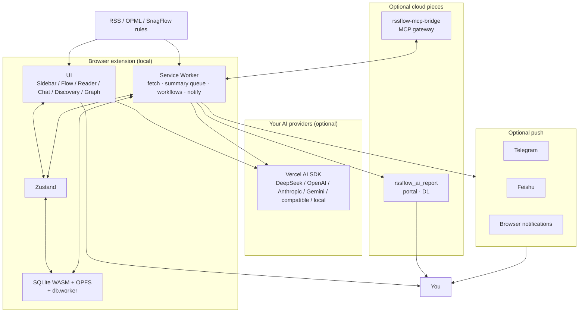

<p align="right">
  <a href="./README.md">简体中文</a> | <strong>English</strong>
</p>

# RSSFlow

> Local-first AI RSS reader for Chrome / Edge  
> Subscribe, read, summarize, chat, graph, schedule briefings, and push — data stays on your machine by default.

<p align="center">
  <a href="https://chromewebstore.google.com/detail/rssflow-ai-powered-rss-in/mefbfkpippglgoanjcbdjnkelcbdjija">
     Chrome Web Store
  </a>
  &nbsp;·&nbsp;
  <a href="https://microsoftedge.microsoft.com/addons/detail/rssflow-aipowered-rss-/khgllclaeabkjgoblcipfpgaejblcelf">
     Edge Add-ons
  </a>
  &nbsp;·&nbsp;
  <a href="https://rssflow.oinchain.com">
     Website
  </a>
</p>

<p align="center">
  
  
  
  
  
</p>

<p align="center">
  <a href="./CHANGELOG.md">Changelog</a> ·
  <a href="https://rssflow.oinchain.com/changelog">Product changelog</a> ·
  <a href="https://rssflow.oinchain.com/help">Help</a> ·
  <a href="https://rssflow.oinchain.com/privacy">Privacy</a>
</p>

---

## What this repository is

**RSSFlow-doc** is the product website, help center, and public release-notes repo.  
It is **not** the extension install-package repository.

| Path | Role |
| --- | --- |
| `website/` | Site source (Next.js static export) |
| `help/` | Help markdown sources |
| `docs/` | Built static site (e.g. Cloudflare Pages) |
| [CHANGELOG.md](./CHANGELOG.md) | Full release history (mirrors the site) |

Install the extension from the store links above. Current public version: **v1.1.5** (2026-08-10).

---

## Product overview

RSSFlow runs as a browser **sidebar** (not a tiny popup): manage feeds, scan unread, open immersive reading, and jump to full-screen Flow / Graph / Discovery / Chat.

A typical path:

1. **Subscribe & store locally**  
2. **Optional AI pre-read** (summary, tags, scores in the background)  
3. **Read & chat** with citations  
4. **Discovery & graph**  
5. **Scheduled workflows & push** (briefings, Telegram / Feishu, report publish)  
6. **Optional MCP** so external tools can use local reading context  

AI uses **your own API keys**. Without keys, it still works as a normal RSS reader.  
Chapter-level docs: https://rssflow.oinchain.com/help

---

## Features

### 1. Feeds & subscription management

- **Add feeds via**
  - Manual RSS URL
  - OPML / XML import
  - One-click import from companion [SnagFlow](https://snagflow.oinchain.com) (extension messaging, no external hop)
  - Recommended catalogs by language/topic (including Japanese / Korean)
- **Per-feed controls**
  - **Auto AI** toggle for automatic summaries
  - Failure / error indicators
  - Delete removes the feed and its history
- **Why auto-summary helps**  
  Structured points, tags, and scores feed Flow filters, graph, workflows, and citation chat. Sending raw full text into heavy jobs hits length limits faster and loses detail.

Help: [Adding feeds](https://rssflow.oinchain.com/help/adding-feeds) · [Feed management](https://rssflow.oinchain.com/help/feed-management) · [SnagFlow](https://rssflow.oinchain.com/help/snagflow-overview)

### 2. Sidebar, Flow, and Zen Reader

**Sidebar tabs**

| Tab | Role |
| --- | --- |
| Inbox | Default unread list, infinite scroll, toolbar badge |
| Favorites | Bookmarks |
| Graph | Opens knowledge graph in a **new tab** |
| Flow | Opens Flow (by day / by tag) in a **new tab** |

**Interaction**

- Single-click card → Zen Reader  
- Double-click → mark read (optional wooden-bell sound) and collapse  
- Standard / Mini density for scanning  
- Cards prefer AI summary; hover shows bullet points  

**Flow**

- **Dayflow**: date → tags, including “last 24 hours”  
- **Tagflow**: tag-first grouping  
- Dot rail jumps groups; per-group AI chat  
- Bottom ticker can scroll / speak summaries (one audio owner across tabs)  
- Multi-column layout; scroll path pauses idle prefetch / optimistic merge to reduce viewport jumps (v1.1.5)  

**Zen Reader**

- Full-screen article + AI rail (summary, bullets, tags, score)  
- Dark starfield / light theme; narrow viewports use a bottom AI drawer  
- Shortcuts: `J`/`K` next/prev, `Space` page, `F` favorite, `R` read+next, `Enter`/`S` summary, `Esc` close  
- Prefetches neighbors while you move through the list  

Help: [Interface](https://rssflow.oinchain.com/help/interface-guide) · [Flow](https://rssflow.oinchain.com/help/flow-view) · [Zen Reader](https://rssflow.oinchain.com/help/zen-reader) · [Shortcuts](https://rssflow.oinchain.com/help/reader-shortcuts)

### 3. AI auto-summary

- New articles can enqueue for background processing with spacing between jobs  
- Writes summary, points, tags, scores locally; cards refresh when ready  
- **Dual profiles** (Settings → AI)  
  - **Basic**: light work (summary, scoring, tags)  
  - **Advanced** (optional): chat, workflows, discovery; copy-from-basic supported  
- Providers include DeepSeek, OpenAI, OpenAI-compatible, Anthropic, Gemini, local compatible hosts, …  
- Turn on **Enable AI Features**, validate, and set the active profile  

Help: [AI keys](https://rssflow.oinchain.com/help/ai-key-config) · [Auto-summary](https://rssflow.oinchain.com/help/ai-auto-summary) · [Providers](https://rssflow.oinchain.com/help/provider-config)

### 4. Chat & expert commands

- Ask over filtered article sets (date, tags, feeds, …)  
- Answers carry **citation chips**: hover to preview, click to jump to the source passage  
- **Expert commands** for research, macro, risk, writing, crypto, … plus custom prompts  
- V3 chat: SmartInput, command palette, session handling; clearing a session aborts in-flight generation and resets filter residue (v1.1.5)  
- Shared **search kernel** with discovery / automation; keyword normalization and unread integrity improved  

Help: [Citation chat](https://rssflow.oinchain.com/help/ai-chat-citation) · [Expert commands](https://rssflow.oinchain.com/help/expert-commands) · [Commands](https://rssflow.oinchain.com/help/ai-commands)

### 5. Discovery & knowledge graph

**Discovery**

- Clusters recent articles into hot topics  
- Charts + topic briefs (phenomenon → logic → second-order effects, depending on model output)  
- Optional refresh cadence and browser notifications  

**Graph**

- Tag co-occurrence / entity-keyword visualization  
- Combinatorial search; results can seed scheduled workflows  
- Graph prompts and reader-related strings are localized  

Help: [Discovery](https://rssflow.oinchain.com/help/ai-discovery) · [Graph](https://rssflow.oinchain.com/help/graph-view)

### 6. Scheduled workflows & report publish

- Background plans: build context (often AI summaries) → run commands → compile briefings  
- **Execution modes**  
  - Single command  
  - **Sequential chain**  
  - **Split-merge** (parallel then reduce)  
- **Publish channels** (global settings above the task list)  
  - Official hosting (zero-config pages)  
  - Self-hosted URL + key (optional retention)  
  - Blog portal (categories, series, authors, …)  
- Combines with push, retry, and tag/date filters  

Help: [Workflows](https://rssflow.oinchain.com/help/workflow-overview) · [Execution modes](https://rssflow.oinchain.com/help/execution-modes) · [Publish modes](https://rssflow.oinchain.com/help/report-modes) · [Cloud portal](https://rssflow.oinchain.com/help/cloud-report-portal)

### 7. Multi-channel push

- **Telegram bot** — per-feature toggles (summary / workflow / discovery, …)  
- **Feishu webhook** — same idea  
- **Browser notifications** for desktop alerts  
- Payload is based on already-processed local results; nothing bulk-uploads the whole library except the channel you configure  

Help: [Telegram](https://rssflow.oinchain.com/help/telegram-push) · [Feishu](https://rssflow.oinchain.com/help/feishu-push)

### 8. MCP bridge

- Expose local feeds/summaries to tools such as Cursor or Claude via MCP  
- Companion `rssflow-mcp-bridge` (Cloudflare Workers); extension side handles bridge state and permissions  
- Useful when reading stays in the browser and analysis moves to an IDE / agent  

Help: [MCP bridge](https://rssflow.oinchain.com/help/mcp-bridge)

### 9. Settings, languages, theme

- Options areas typically include General, Feeds, AI, Notifications, Sync, Automation, Theme, …  
- **General**: fetch interval, list query window, retention, UI language, sounds  
- **Languages**: UI and AI output (EN / ZH / JA / KO and more; set may grow)  
- **Theme**: light / dark / system  
- **Tag scope**: locale-aware default tag sets with broader coverage (v1.1.5)  

Help: [General](https://rssflow.oinchain.com/help/general-settings) · [Languages](https://rssflow.oinchain.com/help/supported-languages) · [Tag scope](https://rssflow.oinchain.com/help/tag-scope) · [Theme](https://rssflow.oinchain.com/help/theme)

### 10. Local storage & privacy

- Heavier search / stats / graph paths use **SQLite (WASM + OPFS) + db.worker**; settings and some state still use extension storage  
- Reading library is not uploaded by default; only enabled features (AI APIs, push, publish, MCP, …) go online  
- See [Privacy policy](https://rssflow.oinchain.com/privacy) and [Privacy help](https://rssflow.oinchain.com/help/privacy-statement)

---

## Architecture (sketch)



**Related projects** (separate; not install packages in this repo)

| Project | Role |
| --- | --- |
| RSSFlow extension | Store-listed reader |
| `rssflow_ai_report` | Cloud report portal |
| `rssflow-mcp-bridge` | MCP gateway |
| SnagFlow | Webpage → RSS companion |

---

## Tech stack (extension, summary)

| Layer | Choice |
| --- | --- |
| Extension | Manifest V3 · Service Worker · Side Panel |
| UI | React 18 · Tailwind · Framer Motion, … |
| Build | Rspack |
| State | Zustand |
| Local DB | SQLite WASM + OPFS · background worker |
| AI | Vercel AI SDK · multi-provider · precompiled prompts |
| Rendering | Streaming markdown · virtualized long lists |

This docs site: Next.js static export on Cloudflare Pages (`rssflow.oinchain.com`), etc.

---

## Releases

- **30 versions** from `v0.1.0` (2024-12) to `v1.1.5` (2026-08)  
- [CHANGELOG.md](./CHANGELOG.md) · https://rssflow.oinchain.com/changelog  

**v1.1.5 highlights**

- Unified article search kernel  
- Keyword normalization & unread / retrieval integrity  
- Flow scroll stability & session cleanup  
- JA/KO recommended feeds & catalog refactor  
- Locale-aware default tag sets  

---

## Install

1. Install from [Chrome](https://chromewebstore.google.com/detail/rssflow-ai-powered-rss-in/mefbfkpippglgoanjcbdjnkelcbdjija) or [Edge](https://microsoftedge.microsoft.com/addons/detail/rssflow-aipowered-rss-/khgllclaeabkjgoblcipfpgaejblcelf) (help docs assume store installs)  
2. Pin the icon for unread badges  
3. Open the **sidebar**  
4. Optional: Settings → AI → enable, add key, validate, set active  
5. Settings → Feeds: URL / OPML / SnagFlow / recommended  

Walkthrough: https://rssflow.oinchain.com/help/installation-setup

---

## Develop this website

```bash
cd website
npm install
npm run dev
npm run build          # → website/out/
npm run generate-help  # when regenerating help site content
```

Deploy tree used online is `docs/` at the repo root (e.g. Cloudflare Pages project `rssflow-landing`).

---

## Links

| | |
| --- | --- |
| Website | https://rssflow.oinchain.com |
| Help | https://rssflow.oinchain.com/help |
| Changelog | [CHANGELOG.md](./CHANGELOG.md) · https://rssflow.oinchain.com/changelog |
| Blog / sample reports | https://blog.oinchain.com |
| SnagFlow | https://snagflow.oinchain.com |
| Privacy | https://rssflow.oinchain.com/privacy |

Feedback: GitHub Issues or contacts on the site footer.

---

## License

Docs and site code follow this repository’s notices. Extension install/use follows Chrome / Edge store terms.
