<p align="right">
  <strong>简体中文</strong> | <a href="./readme_en.md">English</a>
</p>

# 🗺️ RSSFlow Pro
> **AI-Native 跨维度智能情报中心与决策引擎 / The Next-Gen AI-Native Intelligence Center & Decision Engine**

<table align="center" style="border-collapse: collapse; border: none;">
  <tr style="border: none;">
    <td align="center" style="border: none; padding: 0 20px;">
      <a href="https://chromewebstore.google.com/detail/rssflow-ai-powered-rss-in/mefbfkpippglgoanjcbdjnkelcbdjija" target="_blank" style="text-decoration: none; color: inherit;">
        
        <span style="font-size: 16px; font-weight: bold; vertical-align: middle;">Chrome 商店安装</span>
      </a>
    </td>
    <td align="center" style="border: none; padding: 0 20px;">
      <a href="https://microsoftedge.microsoft.com/addons/detail/rssflow-aipowered-rss-/khgllclaeabkjgoblcipfpgaejblcelf" target="_blank" style="text-decoration: none; color: inherit;">
        
        <span style="font-size: 16px; font-weight: bold; vertical-align: middle;">Edge 商店安装</span>
      </a>
    </td>
    <td align="center" style="border: none; padding: 0 20px;">
      <a href="https://rssflow.oinchain.com" target="_blank" style="text-decoration: none; color: inherit;">
        
        <span style="font-size: 16px; font-weight: bold; vertical-align: middle;">访问产品官网</span>
      </a>
    </td>
  </tr>
</table>

<p align="center">
  
  
  
  
  
</p>

---

## 🌟 核心特性 (Advanced Capabilities)

> [!NOTE]
> **RSSFlow Pro** 并非简单的 RSS 订阅聚类工具，而是一个为信息深度消费者、投资研究员及行业专家打造的 **AI-Native 决策支持系统**。它将传统的“被动阅读”流程，重塑为由 AI 主导的“主动探索、认知剖析、智能情报生成、多端云端门户分发与外部 AI Agent 桥接”的闭环决策流。

### 01 / 🌌 AI 探索星系与深度认知洞察 (`AI_Discovery_And_Cognitive_Insights`)
* **今日话题热点发现**：利用底层 LOD-1 XML 级别上下文，结合高级 AI 模型在后台进行海量文章主题的非监督特征聚合，自动识别具有高置信度（Confidence Score ≥ 70）的今日热点话题。
* **现象-逻辑-二阶影响（LOD-2 三层剖析）**：不仅展示发生了什么（现象层），更能通过 AI 深入拆解底层商业逻辑（底层逻辑），并前瞻性预测其引发的连带连锁反应（二阶影响）。
* **认知错位与信息差挖掘**：专门提取舆论中存在的“认知错位”，帮助您在海量泛滥的噪声中快速筛选出具有高决策价值的“信息差”。
* **交互式 Galaxy 可视化**：配合 Framer Motion 动态效果和 ECharts 可视化面板，以三维星系形态将多维数据直观呈现在用户面前。

### 02 / 📑 AI 深度情报报告门户 (`rssflow_ai_report`) 【伴生子系统】
* **轻量级全栈架构**：基于最新的 **Hono v4 (Web 标准全栈框架) + Vite v6 + React 19**，依托 Cloudflare Workers/Pages 构建的极致轻量、超低延迟的在线报告发布终端。
* **D1 云端持久化**：支持将插件端推送的 AI 分析情报存储至 Cloudflare D1 分布式关系型数据库，实现跨终端、跨设备安全阅览。
* **高阶渲染引擎**：提供响应式的 Portal 面板，渲染极致精美的 Markdown 报告，附带图表与可视化动效。

### 03 / 📄 全自动无人值守批量总结 (`AI_Processing_And_Prompt_Automation`)
* **后台异步调度**：基于 Chrome Extension 的 Service Worker 机制与 `summaryQueue`，在浏览器后台静默、并发地拉取、解析文章并生成高品质 GPTsummary。
* **16+ 顶级专家指令集**：内置金融投资、Crypto 趋势、内容创作等多个垂直领域的 Prompt 模板，并支持自动编译与缓存优化（`encodedPrompts.ts`），拒绝千篇一律的普通摘要。

### 04 / 💬 引用追溯的多维知识脉络 Chat (`Contextual_Dialogue`)
* **引文胶囊与精准回溯**：AI 对话中的每一个观点、数据或结论都附带精准的“引文胶囊”。鼠标悬停即可触发实时引文浮层（`CitationHoverCard`），点击一键直达原文对应段落，彻底消除 AI 幻觉。
* **多维度智能上下文聚合**：支持将特定日期、标签下的几十篇关联资讯聚合至单次 Chat 线程中，完成跨文章的多维“会诊”。

### 05 / 🔔 多端情报自动推送与多媒体集成 (`Extensible_Integrations`)
* **跨终端情报推送**：整合 Telegram Bot 与飞书 Webhook 桥接服务（`NotifierHub`），后台静默产出的高分价值情报与热点发现，一秒自动触达您的手机端。
* **沉浸式播客 UI**：支持本地 TTS (文本转语音) 沉浸式后台播放，配合 Podcast 播客化界面，让情报“不仅能读，更能听”。

### 06 / 🔌 边缘 MCP 协议 Agent 进化 (`MCP_Bridge_Gateway`) 【伴生子系统】
* **分布式桥接网关**：内置外部独立项目 `rssflow-mcp-bridge`。这是一个基于 Cloudflare Wrangler / Cloudflare Workers 构建的 Model Context Protocol 桥接服务。
* **双向数据打通**：通过安全令牌，让外部的 AI 代理（如 Cursor、Claude 等）可以直接把 Chrome 插件的本地 IndexedDB 数据作为外部上下文载入，使 RSS 成为您整个电脑 AI Agent 的外部记忆体。

---

## 📐 系统架构与交互拓扑 (System Topology)

项目的整体多维数据流动、物理沙箱边界、网络通信以及最终情报决策的闭环体系如下所示：

```mermaid
graph TD
    subgraph Browser_Sandbox ["Chrome Sandbox (浏览器本地沙箱壁垒)"]
        subgraph Chrome_Sandbox ["Chrome Extension (RSSFlow Pro 插件主系统)"]
            UI["React 18 UI <br> (Sidebar / DayFlow / Discovery / Podcast)"]
            Zustand["Zustand Core Stores <br> (useArticleStore / useSettingsStore)"]
            Background["background.ts <br> (Service Worker 异步任务调度核心)"]
            DB["IndexedDB Storage <br> (本地高并发关系数据库 db.ts)"]
        end
    end

    subgraph Report_Portal ["Cloudflare Pages (云端多端报告在线 Portal)"]
        HonoPortal["rssflow_ai_report <br> (Hono + Vite 6 + React 19)"]
        D1DB["Cloudflare D1 Storage"]
        HonoPortal <--> D1DB
    end

    subgraph External_Gateway ["Cloudflare Workers (MCP 网关代理)"]
        Wrangler["rssflow-mcp-bridge <br> (MCP 远程桥接网关)"]
    end

    subgraph LLM_Cloud ["AI SDK Unified Endpoint (大模型统一调用接口)"]
        AISDK["Vercel AI SDK Core <br> (DeepSeek / Anthropic / OpenAI / Gemini)"]
    end

    subgraph Outbound_Push ["Intelligent Notifier Hub (多渠道通知分发中枢)"]
        Feishu["Feishu Webhook Push"]
        Telegram["Telegram Bot Push"]
    end

    subgraph External_Web ["External Web Source (全球原始信息源)"]
        RSS_Feeds["External RSS Feeds <br> (全球 RSS XML 订阅源)"]
    end

    subgraph Executive_Consumer ["Executive Consumer (多端情报消费与最终决策端)"]
        User["End User <br> (信息深度消费者 / 投资决策者)"]
    end

    %% 1. 本地沙箱内部流动 (Local Processing & Persistence)
    UI -->|Read/Write State| Zustand
    Zustand -->|Query & Read| DB
    Background -->|Batch Ingest & Sync| DB
    Background -->|Active State Sync| Zustand

    %% 2. 数据源输入流 (Ingestion Pipeline)
    RSS_Feeds -->|HTTP Background Scraper| Background
    RSS_Feeds -->|UI Active Refresh Fetch| UI

    %% 3. 大模型智能加工流 (AI Processing & Augmentation)
    UI -->|Direct Stream Chat / Hotspot Analysis| AISDK
    Background -->|Unattended Parallel Summarize| AISDK

    %% 4. 分布式推送与云端发布流 (Distribution Network)
    Background -->|Dispatch Immediate Notifications| Outbound_Push
    Background -->|Sync XML Report Data| HonoPortal

    %% 5. MCP 独立网关远程调用流 (Secure Network Communication)
    Wrangler <-->|WebSocket/HTTPS Secure Tunnel| Background
    Background <-->|Process Bridge Read| DB

    %% 6. 情报闭环消费最后一公里 (Ultimate Decision Loop)
    UI -->|1. Zen Reading & Interactive Star-Galaxy Explore| User
    Outbound_Push -->|2. Mobile Push Alerts & Raw Intelligence| User
    HonoPortal -->|3. View Cross-Device Premium Multi-Dimensional Reports| User

    %% ==========================================
    %% 🌟 PREMIUM AESTHETIC VISUAL STYLING 🌟
    %% ==========================================
    
    %% Style Subgraph Boxes
    style Browser_Sandbox fill:#F8FAFC,stroke:#94A3B8,stroke-width:1px,stroke-dasharray: 5 5;
    style Chrome_Sandbox fill:#F0FDF4,stroke:#22C55E,stroke-width:1.5px;
    style Report_Portal fill:#FAF5FF,stroke:#A855F7,stroke-width:1.5px;
    style External_Gateway fill:#FFF7ED,stroke:#F97316,stroke-width:1.5px;
    style LLM_Cloud fill:#FFFDF5,stroke:#EAB308,stroke-width:1.5px;
    style Outbound_Push fill:#FEF2F2,stroke:#EF4444,stroke-width:1.5px;
    style Executive_Consumer fill:#ECFDF5,stroke:#10B981,stroke-width:2px;
    style External_Web fill:#F8FAFC,stroke:#64748B,stroke-width:1px;

    %% Color Class Definitions for Nodes
    classDef chrome fill:#E8F0FE,stroke:#1A73E8,stroke-width:2px,rx:10px,ry:10px;
    classDef cloud fill:#FAF5FF,stroke:#9333EA,stroke-width:2px,rx:10px,ry:10px;
    classDef mcp fill:#FFF7ED,stroke:#EA580C,stroke-width:2px,rx:10px,ry:10px;
    classDef ai fill:#FFFBEB,stroke:#D97706,stroke-width:2px,rx:10px,ry:10px;
    classDef push fill:#FEF2F2,stroke:#DC2626,stroke-width:2px,rx:10px,ry:10px;
    classDef source fill:#F1F5F9,stroke:#475569,stroke-width:2px,rx:10px,ry:10px;
    classDef consumer fill:#D1FAE5,stroke:#065F46,stroke-width:2.5px,font-weight:bold,rx:15px,ry:15px;

    %% Apply Classes to Specific Nodes
    class UI,Zustand,Background,DB chrome;
    class HonoPortal,D1DB cloud;
    class Wrangler mcp;
    class AISDK ai;
    class Feishu,Telegram push;
    class RSS_Feeds source;
    class User consumer;
```



---

---

## 🏢 领域驱动目录设计 (Domain-Driven Cartography)

> [!TIP]
> 全局路由表 `global_router.md` 仅提取关键编排层；而在本项目 `README.md` 中，我们将目录拓扑延展扩充，为您完整展现整个代码库的物理层级结构：

```
d:\github\RSSFlowpro/
├── rssflow_ai_report/         # 【伴生系统】独立 AI 深度报告门户系统 (Hono + Vite 6 + React 19)
│   ├── src/
│   │   ├── pages/             # Portal 核心页面 (Portal.tsx)
│   │   └── index.ts           # Hono API 接口逻辑与渲染控制器
│   ├── migrations/            # 关系型数据库结构演进迁移脚本
│   ├── wrangler.toml          # Cloudflare Pages / D1 部署配置
│   └── schema.sql             # 本地 Cloudflare D1 SQL 初始化定义
├── rssflow-mcp-bridge/        # 【伴生系统】独立的外部 MCP 桥接网关子系统 (Wrangler + Workers)
│   ├── src/
│   │   ├── index.ts           # MCP 核心服务网关逻辑
│   │   └── types.ts           # MCP 基础协议定义
│   └── wrangler.toml          # Cloudflare Workers 部署配置文件
├── src/                       # 【核心插件项目】Manifest V3 Chrome 扩展程序
│   ├── components/            # UI 交互层
│   │   ├── common/            # [NEW] 共享跨页 UI (引文悬浮卡 CitationHoverCard / MarkdownStreamView)
│   │   ├── discovery/         # [Domain] AI 探索与宇宙星系可视化 UI (DiscoveryPage.tsx)
│   │   ├── chat/              # [Domain] 引文追溯 Chat 对话 UI (ChatController.tsx)
│   │   ├── podcast/           # [Domain] 沉浸式音频播放与播客化 UI (PodcastView.tsx / AudioPlayer.tsx)
│   │   ├── options/           # 插件全局选项与 AI 模型参数设置面板
│   │   ├── sidebar/           # 插件核心主侧边栏组件
│   │   ├── reader/            # 沉浸式专注阅读模式组件
│   │   ├── htmlPreview/       # 安全 iframe 级原网页离线快照预览组件
│   │   ├── modals/            # 核心业务模态窗 (汇总弹窗 SummaryModal 等)
│   │   ├── ticker/            # 插件顶栏微动状态跑马灯指示组件
│   │   └── FloatingNavManager.ts # UI 悬浮快捷控制管理器
│   ├── services/              # 核心业务逻辑层 (Services Engine)
│   │   ├── generated/         # [Domain] 预编译只读 Prompts 缓存 (encodedPrompts.ts)
│   │   ├── automation/        # [Domain] 多端推送调度中心 (NotifierHub.ts)
│   │   ├── discoveryManager.ts# [Domain] 探索发现 AI 调度中心
│   │   ├── discoveryChatService.ts # [Domain] 探索对话上下文生成服务
│   │   ├── AIChatService.ts   # [Domain] AI 交互及流式输出管理
│   │   ├── promptManager.ts   # [Domain] 动态 Prompt 模板调度器
│   │   ├── rssManager.ts      # [Domain] RSS 订阅源底层拉取与解析器
│   │   ├── articleManager.ts  # [Domain] 文章批量去重与标记逻辑
│   │   ├── mcpBridgeService.ts# [Domain] 本地 MCP 桥接状态管理
│   │   └── feishuService.ts   # [Domain] 飞书推送底层服务
│   ├── store/                 # 全局数据模型与内存状态层
│   │   ├── useArticleStore.ts # [State] 订阅与文章全局 Zustand 状态
│   │   └── useSettingsStore.ts# [State] 插件与 AI 秘钥全局 Zustand 状态
│   ├── utils/                 # [NEW] 底层公共网络与基建包
│   │   ├── messageHandler.ts  # 跨多进程 (Worker-CS-UI) 通信底层高阶分流路由
│   │   ├── lruCacheManager.ts # 基于内存及 chrome.storage 双层高性能 LRU 缓存管理器
│   │   └── optimizedDOMManager.ts # 针对超长列表安全净化的防抖 DOM 渲染工具
│   ├── db.ts                  # [DB] IndexedDB 底层存储引擎 (Dexie 关系型查询)
│   ├── types.ts               # [Model] 全局 TypeScript 数据结构与接口定义
│   └── background.ts          # [Entry] Service Worker 后台守护进程与多任务调度循环
├── docs/                      # 核心产品设计、演进路线与接口协议文档
├── scripts/                   # 开发工程辅助脚本 (如 build-prompts.js 提示词预编译脚本)
├── tailwind.config.js         # Tailwind CSS v4.0 沙箱级全局样式编译配置
└── webpack.config.js          # Webpack 5 多模块分包打包配置文件
```

---

## 📚 核心设计与高阶架构文档

为了更深层次了解 RSSFlow Pro 的底层运作机制，项目内置了以下极其详尽的架构文档，供深入研读：

*   [📘 核心多进程交互与线程架构 (ARCHITECTURE.md)](file:///d:/github/RSSFlowpro/ARCHITECTURE.md)：深入拆解 Chrome 插件 Service Worker、Content Scripts 与 UI Panel 之间的双向异步安全通信架构及 IndexedDB 锁机制。
*   [🤖 大模型选用及 Prompt 参数优化规范 (ARCHITECTURE_LLM.md)](file:///d:/github/RSSFlowpro/ARCHITECTURE_LLM.md)：详细梳理了多模态模型选择策略、置信度阈值调优算法，以及内置 16 套专家级 System Prompt 的工业级微调规范。
*   [🌟 未来 AI 决策体与多模态演进蓝图 (FUTURE_AI_POTENTIAL.md)](file:///d:/github/RSSFlowpro/FUTURE_AI_POTENTIAL.md)：构想了未来的自主进化型阅读器、多模态图表解析 Agent 以及全自动资产配置顾问决策模型。
*   [🎨 高阶交互视觉美学设计指南 (SIDEBAR_STYLE_GUIDE.md)](file:///d:/github/RSSFlowpro/SIDEBAR_STYLE_GUIDE.md)：规定了沉浸式暗色模式、Glassmorphism 玻璃拟态设计体系以及交互反馈微动效的全局视觉美学红线。

---

## 🛠️ 顶配技术栈 (Tech Specs Matrix)

| 维度 | 技术选型 | 核心价值描述 |
| :--- | :--- | :--- |
| **插件基础** | Chrome Extension Manifest V3 | 遵循最新规范，支持异步 Service Worker 长期生命周期保活与任务调度。 |
| **插件前端** | React 18.2 + Webpack 5 | 支持 React 18 并发渲染与极速响应，Webpack 5 跨模块编译。 |
| **门户全栈** | Hono v4 + Vite v6 + React 19 | 运用微服务标准架构，利用 React 19 核心引擎在 Cloudflare 边缘极速渲染云端门户。 |
| **状态机制** | Zustand v5 | 去中心化的、极速轻量的状态原子，具备跨多页面视图响应的高性能优势。 |
| **样式体系** | **Tailwind CSS v4.0** (插件) + **v3.4** (门户) | 针对 Chrome 沙箱引入高编译性能的 v4 系列；针对 Portal 端配合成熟的 v3 系统。 |
| **智能模型** | Vercel AI SDK Core (ai) | 统一支持 DeepSeek, Anthropic, OpenAI, GoogleCompatible 等多端云端接口。 |
| **流式解析** | Streamdown + Virtua | 专为极其流畅的 Markdown 流式展示打造，支持超长虚拟滚动列表优化（`virtua`）。 |
| **本地库** | Dexie / IndexedDB | 跨越 GB 级别的高性能本地关系型数据库缓存，支持高频多字段索引检索。 |

---

## 🚀 开发者安装与调试指南

### 1. 主插件项目构建

> [!IMPORTANT]
> 在构建项目前，请确保您的 Node.js 环境版本 ≥ 18.x。

#### 步骤 A：安装与依赖拉取
```bash
# 进入项目根目录并拉取完整依赖
npm install
```

#### 步骤 B：预编译编译 AI 提示词（关键）
```bash
# 将 src/services/prompts 目录下的 Markdown 格式 Prompts 编译为高性能 TypeScript 缓存
npm run build:prompts
```

#### 步骤 C：构建编译
* **开发热重载模式 (推荐)**：
  ```bash
  npm run dev
  ```
  此命令将自动监听 `src/` 下任何文件的修改并触发 Webpack 自动重连编译。
* **生产模式打包**：
  ```bash
  npm run build
  ```

#### 步骤 D：载入 Chrome 浏览器
1. 打开 Chrome 浏览器，进入扩展管理页 `chrome://extensions/`；
2. 勾选右上角的 **开发者模式 (Developer Mode)**；
3. 点击左上角的 **加载已解压的扩展程序 (Load unpacked)**；
4. 选择并载入项目根目录下的 `dist/` 文件夹。

---

### 2. 外部 MCP 桥接网关构建 (`rssflow-mcp-bridge`)

如果您需要打通外部 AI Agent 调度您本地插件的 RSS 数据，可按照以下指令运行该配套微服务：

```bash
# 1. 进入桥接子目录
cd rssflow-mcp-bridge

# 2. 安装 Wrangler 及配套依赖
npm install

# 3. 运行本地 MCP 测试实例
npx wrangler dev src/index.ts --local
```

---

### 3. AI 深度报告门户构建 (`rssflow_ai_report`)

如果您需要部署或在本地调试云端多端报告 Portal 应用：

```bash
# 1. 进入报告子目录
cd rssflow_ai_report

# 2. 安装 React 19 与 Hono 配套依赖
npm install

# 3. 本地启动 Hono + Vite 开发服务器
npm run dev

# 4. 一键打包并部署至 Cloudflare Pages 平台
npm run deploy
```

---
