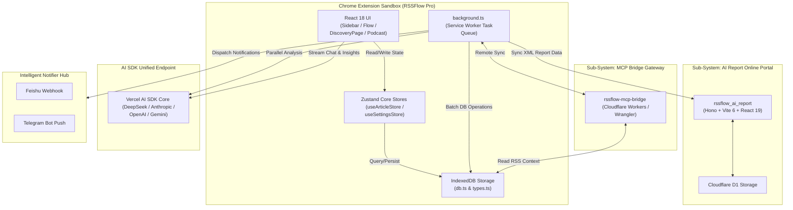

<p align="right">
  <a href="./readme.md">简体中文</a> | <strong>English</strong>
</p>

# 🗺️ RSSFlow Pro
> **The Next-Gen AI-Native Intelligence Center & Decision Engine**

<p align="center">
  
  
  
  
  
</p>

---

## 🌟 Advanced Capabilities

> [!NOTE]
> **RSSFlow Pro** is not a simple RSS subscription aggregation tool, but an **AI-Native Decision Support System** engineered for information power consumers, investment researchers, and industry experts. It reshapes the traditional "passive reading" workflow into an AI-driven, closed-loop decision pipeline comprising "active discovery, cognitive dissection, smart intelligence generation, multi-device cloud portal distribution, and external AI Agent bridging."

### 01 / 🌌 AI Discovery Galaxy & Deep Cognitive Insights (`AI_Discovery_And_Cognitive_Insights`)
* **Today's Hot Topic Discovery**: Leverages underlying LOD-1 XML-level context, combined with advanced AI models running in the background, to perform unsupervised feature aggregation across massive articles. Automatically identifies today's hot topics with high confidence (Confidence Score ≥ 70).
* **Phenomenon - Logic - Second-Order Impact (LOD-2 Three-Layer Analysis)**: Goes beyond merely displaying what happened (Phenomenon layer). AI conducts deep dissections into the underlying commercial logic (Core Logic) and proactively forecasts sequential chain reactions (Second-Order Impact).
* **Cognitive Dissonance & Information Arbitrage Extraction**: Specifically extracts "cognitive dissonance" in public opinion, helping you quickly sieve out high-value "information arbitrage" from overflowing noise.
* **Interactive Galaxy Visualization**: Paired with Framer Motion dynamic transitions and ECharts visualization panels to intuitively present multi-dimensional data as a 3D orbital galaxy.

### 02 / 📑 AI Deep Intelligence Report Portal (`rssflow_ai_report`) [Companion Subsystem]
* **Lightweight Full-Stack Architecture**: Built on the latest **Hono v4 (Web standards full-stack framework) + Vite v6 + React 19**, leveraging Cloudflare Workers/Pages for an extremely lightweight, ultra-low latency online report publishing terminal.
* **D1 Cloud Persistence**: Supports persisting AI intelligence reports pushed from the browser extension into Cloudflare D1 distributed relational database, enabling secure cross-terminal, cross-device viewing.
* **Premium Rendering Engine**: Provides a responsive Portal dashboard that renders exquisitely styled Markdown reports, complete with embedded charts and dynamic visualization effects.

### 03 / 📄 Full-Autopilot Unattended Batch Summarization (`AI_Processing_And_Prompt_Automation`)
* **Background Asynchronous Scheduling**: Built on Chrome Extension's Service Worker mechanism and `summaryQueue` to fetch, parse, and generate high-quality GPTSummaries silently and concurrently in the background.
* **16+ Elite Expert Instructions**: Built-in prompt templates for multiple vertical fields such as financial investment, Crypto trends, content creation, etc. Supports automatic compilation and cache optimization (`encodedPrompts.ts`), rejecting generic, cookie-cutter summaries.

### 04 / 💬 Citation-Traced Multi-Dimensional Knowledge Chat (`Contextual_Dialogue`)
* **Citation Capsules & Precise Traceability**: Every viewpoint, datum, or conclusion in the AI dialogue comes with a precise "Citation Capsule". Hovering triggers a real-time citation overlay (`CitationHoverCard`), and clicking directly scrolls to the original article segment, completely eliminating AI hallucinations.
* **Multi-Dimensional Context Aggregation**: Supports aggregating dozens of related articles under specific dates or tags into a single chat thread for cross-article multi-dimensional "joint consultations".

### 05 / 🔔 Multi-Channel Auto-Push & Multimedia Integration (`Extensible_Integrations`)
* **Cross-Device Intelligence Push**: Integrates Telegram Bot and Feishu Webhook bridging service (`NotifierHub`) to push high-value intelligence and hot discoveries generated in the background to your mobile device within seconds.
* **Immersive Podcast UI**: Supports local TTS (Text-to-Speech) immersive background playback, paired with a podcast-style interface, making intelligence "not just readable, but listenable."

### 06 / 🔌 Edge MCP Protocol Agent Evolution (`MCP_Bridge_Gateway`) [Companion Subsystem]
* **Distributed Bridging Gateway**: Includes the independent companion project `rssflow-mcp-bridge`, a Model Context Protocol bridging service built on Cloudflare Wrangler / Cloudflare Workers.
* **Bi-directional Data Pipeline**: Uses secure tokens to allow external AI Agents (e.g. Cursor, Claude, etc.) to directly load the local IndexedDB data of the Chrome Extension as external context, turning RSS into an external memory unit for all your computer's AI Agents.

---

## 📐 System Topology

The overall multi-dimensional data flow and system boundary partition of the project are illustrated below:



---

## 🏢 Domain-Driven Cartography

> [!TIP]
> The global router `global_router.md` only extracts critical orchestrating layers. In this main `README.md`, we extend the structural map to fully display the physical topology of the codebase:

```
d:\github\RSSFlowpro/
├── rssflow_ai_report/         # [Companion] Independent AI Deep Report Portal (Hono + Vite 6 + React 19)
│   ├── src/
│   │   ├── pages/             # Portal Core Pages (Portal.tsx)
│   │   └── index.ts           # Hono API Logic & Render Controller
│   ├── migrations/            # Relational database schema evolution migrations
│   ├── wrangler.toml          # Cloudflare Pages / D1 deployment config
│   └── schema.sql             # Local Cloudflare D1 SQL initialization definition
├── rssflow-mcp-bridge/        # [Companion] Independent external MCP bridging gateway subsystem (Wrangler + Workers)
│   ├── src/
│   │   ├── index.ts           # MCP Core gateway service logic
│   │   └── types.ts           # MCP Core protocol definitions
│   └── wrangler.toml          # Cloudflare Workers deployment config file
├── src/                       # [Core Extension Project] Manifest V3 Chrome Extension
│   ├── components/            # UI Interaction Layer
│   │   ├── common/            # [NEW] Shared cross-page UI (CitationHoverCard / MarkdownStreamView)
│   │   ├── discovery/         # [Domain] AI Discovery & Galaxy Space Visualization UI (DiscoveryPage.tsx)
│   │   ├── chat/              # [Domain] Citation Tracing Chat UI (ChatController.tsx)
│   │   ├── podcast/           # [Domain] Immersive Audio Playback & Podcast UI (PodcastView.tsx / AudioPlayer.tsx)
│   │   ├── options/           # Extension global options & AI model settings panel
│   │   ├── sidebar/           # Extension core sidebar component
│   │   ├── reader/            # Immersive reading mode component
│   │   ├── htmlPreview/       # Safe iframe-level offline web snapshot preview component
│   │   ├── modals/            # Core business modals (SummaryModal, etc.)
│   │   ├── ticker/            # Extension top bar micro-state marquee ticker
│   │   └── FloatingNavManager.ts # UI Floating Nav Manager
│   ├── services/              # Core Business Logic Layer (Services Engine)
│   │   ├── generated/         # [Domain] Precompiled read-only prompts cache (encodedPrompts.ts)
│   │   ├── automation/        # [Domain] Multi-channel notification dispatch center (NotifierHub.ts)
│   │   ├── discoveryManager.ts# [Domain] Discovery AI Orchestrator
│   │   ├── discoveryChatService.ts # [Domain] Discovery Dialogue Context Service
│   │   ├── AIChatService.ts   # [Domain] AI Interaction & Stream Output Manager
│   │   ├── promptManager.ts   # [Domain] Dynamic Prompt Template Scheduler
│   │   ├── rssManager.ts      # [Domain] RSS Feed Parser & Fetcher
│   │   ├── articleManager.ts  # [Domain] Batch Article Deduplication & Flagging
│   │   ├── mcpBridgeService.ts# [Domain] Local MCP Bridge State Management
│   │   └── feishuService.ts   # [Domain] Feishu notification service
│   ├── store/                 # Global Data Models & Memory State Layer
│   │   ├── useArticleStore.ts # [State] Global Zustand store for articles & subscriptions
│   │   └── useSettingsStore.ts# [State] Global Zustand store for settings & AI API keys
│   ├── utils/                 # [NEW] Underlying common networking & utilities
│   │   ├── messageHandler.ts  # Cross-process (Worker-CS-UI) communications dispatcher router
│   │   ├── lruCacheManager.ts # High-performance memory & chrome.storage dual-layer LRU Cache Manager
│   │   └── optimizedDOMManager.ts # Debounced safe DOM renderer for virtualized long lists
│   ├── db.ts                  # [DB] IndexedDB storage engine (Dexie relational query wrapper)
│   ├── types.ts               # [Model] Global TypeScript types & interface definitions
│   └── background.ts          # [Entry] Service Worker daemon & background queue loop
├── docs/                      # Core product designs, roadmap, and API protocols
├── scripts/                   # Development script utilities (e.g. prompt compilation builder)
├── tailwind.config.js         # Tailwind CSS v4.0 sandbox-level styling configuration
└── webpack.config.js          # Webpack 5 multi-entry bundle configuration
```

---

## 📚 Core Design & Advanced Architecture Documents

To gain a deeper understanding of the inner workings of RSSFlow Pro, the following comprehensive architectural docs are built-in for deep reading:

*   [📘 Core Multi-Process Communication & Threading Architecture (ARCHITECTURE.md)](file:///d:/github/RSSFlowpro/ARCHITECTURE.md): Deep dissection of asynchronous secure message passing between Service Worker, Content Scripts, and UI Panels, alongside IndexedDB locking mechanisms.
*   [🤖 Large Language Model Selection & Prompt Optimization Standard (ARCHITECTURE_LLM.md)](file:///d:/github/RSSFlowpro/ARCHITECTURE_LLM.md): Detailed analysis of multi-modal model selection strategies, confidence threshold tuning algorithms, and fine-tuning standards for 16 built-in expert-grade System Prompts.
*   [🌟 Autonomous AI Agents & Multi-Modal Evolution Blueprint (FUTURE_AI_POTENTIAL.md)](file:///d:/github/RSSFlowpro/FUTURE_AI_POTENTIAL.md): Architectural roadmap for self-evolving readers, multi-modal chart analytics Agents, and fully automated asset allocation advisory models.
*   [🎨 High-End Interactive Aesthetics Design Guideline (SIDEBAR_STYLE_GUIDE.md)](file:///d:/github/RSSFlowpro/SIDEBAR_STYLE_GUIDE.md): Global styling constraints on immersive dark modes, Glassmorphism design systems, and micro-interaction dynamic feedback loops.

---

## 🛠️ Tech Specs Matrix

| Dimension | Tech Choice | Core Value Description |
| :--- | :--- | :--- |
| **Extension Core** | Chrome Extension Manifest V3 | Fully adheres to modern standards, supporting persistent Service Worker lifecycles and background task scheduling. |
| **Extension UI** | React 18.2 + Webpack 5 | Features React 18 concurrent rendering for instant responsiveness, bundled under Webpack 5 modular optimization. |
| **Portal Full-Stack** | Hono v4 + Vite v6 + React 19 | Microservices design leveraging React 19 core engine for lightning-fast edge rendering on Cloudflare Pages. |
| **State Engine** | Zustand v5 | Decentralized, ultra-lightweight atomic state, optimizing cross-view responsive performance. |
| **Style Paradigm** | **Tailwind CSS v4.0** (Extension) + **v3.4** (Portal) | High-performance v4 compilation for Chrome sandboxes; mature, stable v3 system for Web Portal. |
| **Smart Interface** | Vercel AI SDK Core (`ai`) | Unified endpoint supporting DeepSeek, Anthropic, OpenAI, GoogleCompatible, and local LLMs. |
| **Stream Parser** | Streamdown + Virtua | Optimized for fluid real-time Markdown rendering, utilizing `virtua` for ultra-long list virtual scrolling. |
| **Local Database** | Dexie / IndexedDB | High-performance local relational DB wrapper for GB-scale data caching with fast multi-index queries. |

---

## 🚀 Developer Installation & Debugging Guide

### 1. Main Extension Project Construction

> [!IMPORTANT]
> Before building the project, please ensure your local Node.js environment is version ≥ 18.x.

#### Step A: Dependency Resolution
```bash
# Navigate to the project root and install all dependencies
npm install
```

#### Step B: Pre-compile AI Prompts (Critical)
```bash
# Compiles Markdown prompts in src/services/prompts into high-performance TypeScript caches
npm run build:prompts
```

#### Step C: Build Configuration
* **Development Hot Reload Mode (Recommended)**:
  ```bash
  npm run dev
  ```
  This command automatically watches all files in `src/` and triggers instant Webpack incremental recompilation.
* **Production Distribution Package**:
  ```bash
  npm run build
  ```

#### Step D: Load into Google Chrome
1. Open Google Chrome and go to the extension management page: `chrome://extensions/`;
2. Toggle on **Developer Mode** in the upper right corner;
3. Click **Load unpacked** in the upper left corner;
4. Select and load the `dist/` directory generated in the project root.

---

### 2. External MCP Bridge Gateway Setup (`rssflow-mcp-bridge`)

If you need to connect external AI Agents to dispatch your local browser's RSS data context, run the companion microservice using:

```bash
# 1. Enter the bridge gateway directory
cd rssflow-mcp-bridge

# 2. Install Wrangler and associated dependencies
npm install

# 3. Spin up a local MCP worker instance
npx wrangler dev src/index.ts --local
```

---

### 3. AI Deep Report Portal Deployment (`rssflow_ai_report`)

To deploy or locally debug the cloud-native multi-device Report Portal application:

```bash
# 1. Enter the report directory
cd rssflow_ai_report

# 2. Install dependencies for React 19 and Hono
npm install

# 3. Launch Hono + Vite development server locally
npm run dev

# 4. Compile and deploy instantly to Cloudflare Pages
npm run deploy
```
